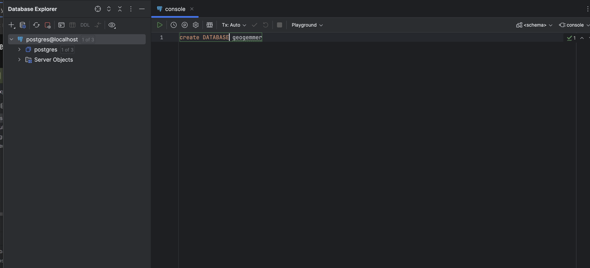
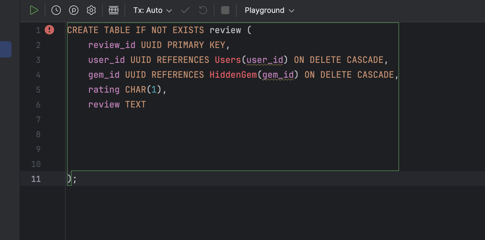

Assignees:
- Jus: HiddenGem, Images, GemsVisited
- Tom: User, Accesibility,

# Part 1

This document provides the necessary steps for setting up and developing the backend components of our project. Follow the instructions carefully to ensure consistency and efficiency in our development process.

## 1. Database Creation in DataGrip

Begin by creating a new database within DataGrip. Pretty much do exactly as you did for the module 10 assignment, but name your database ```geogemmer```




## 2. Model Implementation in SQL

Once your database is set up, proceed to implement the models for the specific database "boxes" inside the       ```DatabaseDiagram.md``` file you've been assigned. (look at the top of this document for your assigned ones). Your are going to model the classes you have been assigned inside datagrip as a model. 

For a example, I have made a model for the ```reviews.py class.``` This is what it looks like in datagrip below




## 3. Place database model inside python file

Once you are done making your database model, Place it inside the corresponding Python file that's in the /models folder in the repo and encase it in comments. For the review one, I placed mine inside the ```review.py``` file. Go check it out if you want a reference for what it should look like.

### 4. Once you hit here you're done (for now)

# The point of this Whole thing is for 2 things:

- I'm testing a new way of explaining things to you guys and I want to see if it works out well.
- In order to set up the methods for the repository classes, we need all the models to be set up.
